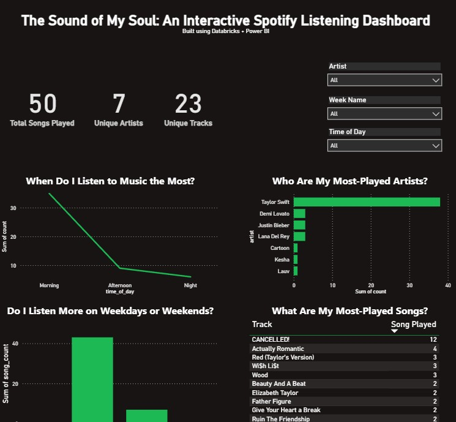
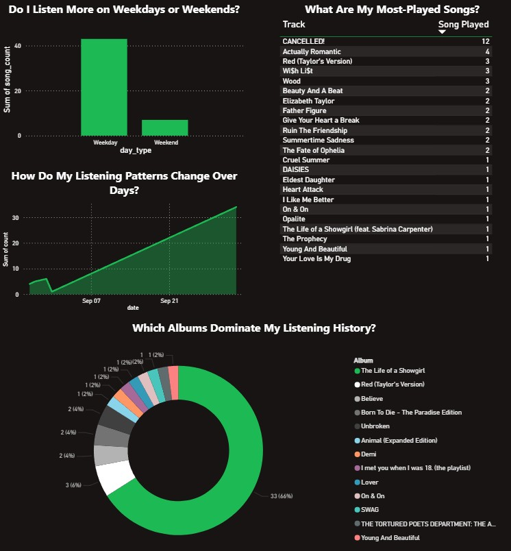

# Spotify Listening Analytics Dashboard

This project analyzes my Spotify listening history using **Spotify Web API**, **Databricks (PySpark + SQL)**, and **Power BI**.  

> **Inspiration:**  
> The release of Taylor Swift’s new album *The Life of a Showgirl* made me curious about how much her music really dominates my playlists, and how my listening changes by time of day and week.


---

## Pipeline Overview

The pipeline follows the **Bronze - Silver - Gold** model:  

- **Bronze** - Raw listening history from Spotify API stored in CSV  
- **Silver** - Cleaned dataset with track, artist, album, played_date, hour, weekday/weekend  
- **Gold** - Aggregated analytics tables for Power BI visualizations  

---

## Implementation

### 1. Ingesting Data from Spotify  
I used the **Spotify Web API** to fetch my listening history. The data is stored in a CSV file `spotify_recent.csv`.  

### 2. Cleaning & Transforming with PySpark

```python
df = spark.read \
    .format("csv") \
    .option("header", "true") \
    .option("inferSchema", "true") \
    .load("/FileStore/spotify_recent.csv")

df_clean = df.withColumn("played_date", to_date("played_at")) \
             .withColumn("hour", hour("played_at")) \
             .withColumn("day_of_week", date_format("played_at", "E"))
```
### 3. Aggregations

The data was aggregated using **PySpark transformations** inside Databricks.  

For example, I grouped by artist to count total plays:

```python
gold_top_artists = silver_df.groupBy("artist") \
    .count() \
    .orderBy(col("count").desc())
```
If needed, the same logic could also be expressed in SQL (Databricks SQL):
```sql
-- Top Artists
SELECT artist, COUNT(*) AS song_count
FROM silver_tracks
GROUP BY artist
ORDER BY song_count DESC;
```
Full transformations and aggregations can be found in the [Spotify Analysis Notebook](./spotify_analysis.ipynb).

## Power BI Dashboard  

The **Gold Layer** was connected to Power BI (DirectQuery mode).  

### Dashboard Highlights  
- **Top Artists & Songs** = Who I listen to most  
- **Peak Listening Hours** = Morning, afternoon, night trends  
- **Weekday vs Weekend** = Do I stream more on weekdays or weekends?  
- **Listening Trends Over Time** = Daily/weekly listening patterns  
- **Album Popularity** = Which albums dominate (*spoiler: Taylor Swift*)  


---

## Screenshots  
  
  

---

## Learnings  

- How to authenticate and pull data from the **Spotify Web API**  
- Cleaning and transforming event logs with **PySpark**  
- Creating **Gold aggregations** with SQL  
- Connecting **Databricks SQL to Power BI**  
- Designing a **Spotify-themed dashboard**  

---

## Next Steps  

- Automate daily ingestion with a scheduler  
- Add more features from Spotify (tempo, danceability, energy)  
- Compare listening trends before and after **Taylor Swift’s album drops**  

---

*Built with Databricks + Power BI. Fueled by Taylor Swift on repeat.*
